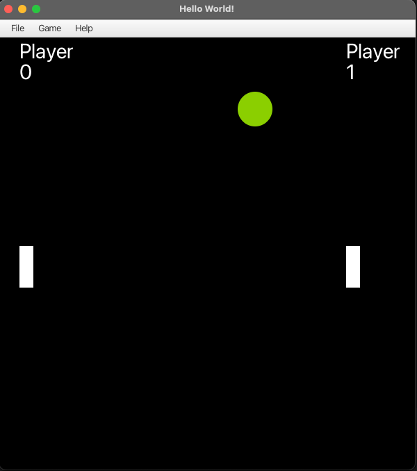

<h3 align="center">Ping Pong</h3>

Simple crude JavaFX ping pong game

### Screenshots
  

#### How to use
It is very easy! Load up an editor such as intelliJ, create a JavaFX application and copy the files into the directory

#### Contributing
If you have any idea how to make this app better, please [create a pull request](https://github.com/JaredWestley/Ping-Pong/compare). If you find any bug, please [create an issue](https://github.com/JaredWestley/Ping-Pong/issues/new).

#### License
This project is licensed under an MIT license. Please check [LICENSE](LICENSE).
